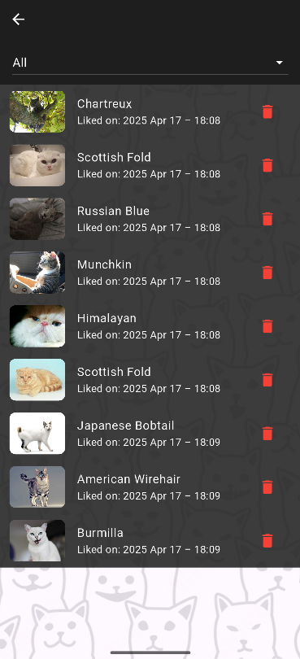
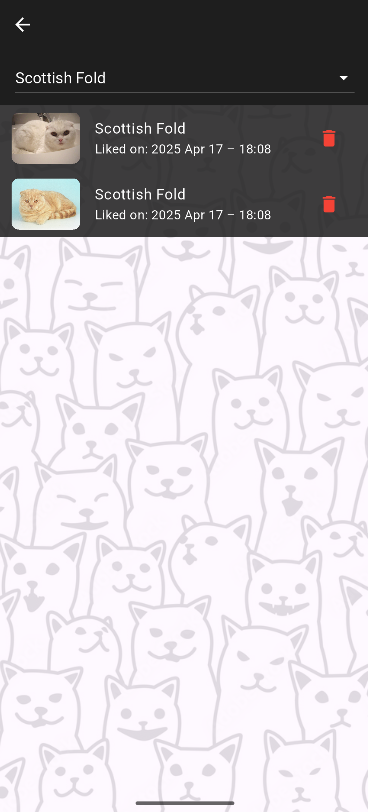

# Кототиндер - найди своего идеального котика!

Проект "Кототиндер" - приложение, которое поможет Вам найти Вашего идеального котика!

*Ссылка на актуальный APK: https://disk.yandex.ru/d/rMw-_3rI9mrRVg*

# Фичи

## Главный экран

- На главной странице расположены карточки с фотографиями котиков, их породой
и происхождением
- Свайпнув вправо, можно лайкнуть котика; свайпнув влево - поставить бедняжке
дизлайк =( При этом увеличится соответствующий счетчик, а также поменяет
состояние полоса распределения оценок
- Также можно нажать на кнопку лайка или дизлайка, и карточка смахнется сама

  

## Экран "подробнее"

- При нажатии на самого котика откроется экран с детальным описанием породы,
характером, типичным для этой породы пушистых, а также средней продолжительностью
жизни и страной происхождения
- Если текст не помещается на экран, страницу можно пролистать вниз
- Нажав на стрелку в левом верхнем углу экрана, можно вернуться на 
главный экран

## Экран лайкнутых котиков

- При нажатии на иконку меню в правом верхнем углу открывается меню лайкнутых котиков
- В списке показывается фото котика, его порода и дата и время, когда он был лайкнут Вами
- Нажав на элемент списка, можно перейти на экран подробной информации о пушистом
- Котиков можно отфильтровать по породе, для этого используется выпадающий список
- Нажав на красную иконку справа от котика, можно удалить его из любимых =(
При этом изменится счетчик количества лайков на главном экране

### UX

- Котокарточки подгружаются заранее, что делает использование приложения
более приятным
- При длительной загрузке при входе в приложение появляется экран с индикатором прогресса
- При ошибке подключения всплывает диалоговое окно, позволяющее повторить попытку загрузки котика
