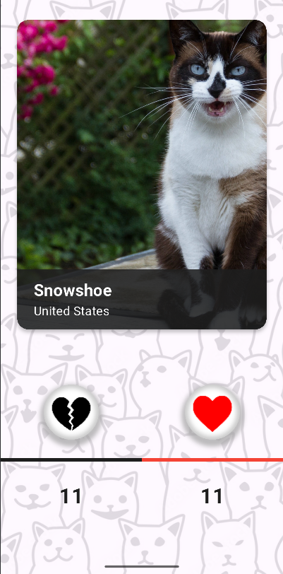
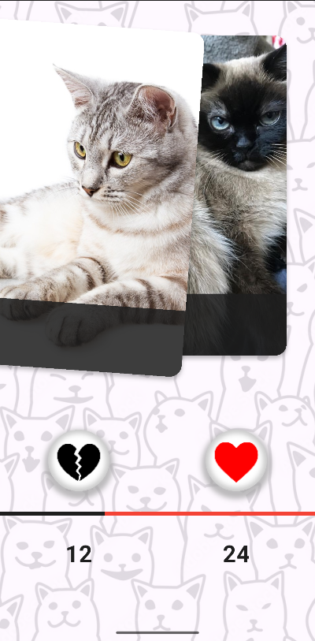
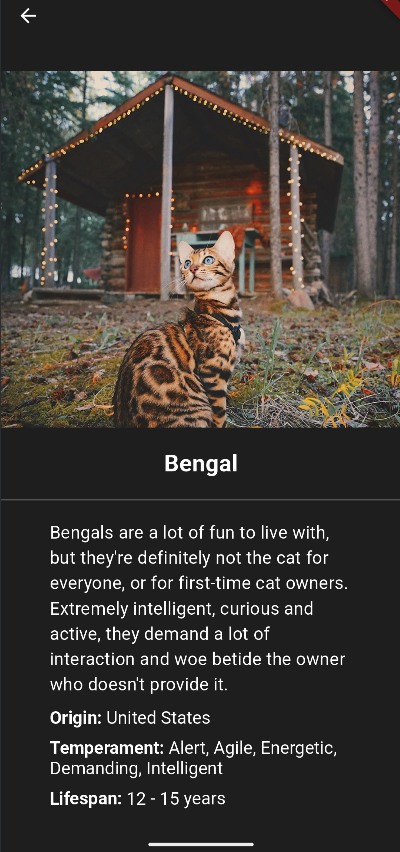

# Кототиндер - найди своего идеального котика!

Проект "Кототиндер" - приложение, в котором вы можете просматривать 
тысячи различных котиков, лайкать понравившихся и дизлайкать тех, 
что не приглянулись, а также узнать побольше о каждом.

## Фичи

- На главной странице расположены карточки с фотографиями котиков, их породой
и происхождением
- Свайпнув влево, можно лайкнуть котика; свайпнув вправо - поставить бедняжке
дизлайк =( При этом увеличится соответствующий счетчик, а также поменяет
состояние полоса распределения оценок
- Карточки подгружаются заранее, что делает использование приложения
более приятным
- При нажатии на самого котика откроется экран с детальным описанием породы,
характером, типичном для этой породы пушистых, а также средняя продолжительность
жизни и страна происхождения
- Нажав на стрелку в левом верхнем углу экрана, можно вернуться на 
главный экран

## Скриншоты

 
